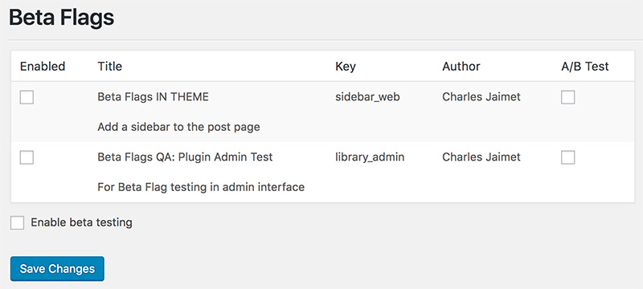
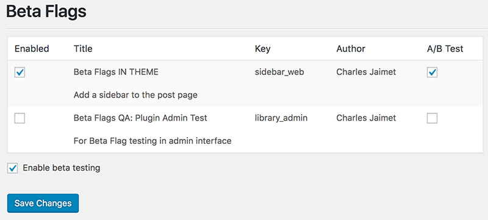

# Beta Flags
**Version:** 1.3.0<br />
**Author:** Charles Jaimet @cmjaimet<br />
**Thanks to:** James Williams, whose plugin inspired this one
(https://github.com/jamesrwilliams/feature-flags)

**Note: A/B testing absent for now due to Batcache concerns. It will be back soon!**

Beta Flags allow developers to manage the release of new features. Instead of having code execute as soon as it is deployed to the production environment. You can now wrap it in a beta flag conditional and activate it from the back end.

A/B Testing works very similarly, except that instead of turning a code block on or off, they allow you to turn it on 50% of the time. This uses a slight variant on the URL used to display a post or term page, which can then be tracked in an analytics service (e.g. Adobe Omniture, Google 360).

## The Basics of Beta Flags
To create a new beta flag, open the configuration JSON file. A copy of this file is provided with this plugin and is stored at `data/beta-flags.json`. You may prefer to create a copy in the root of your theme, the same folder that contains functions.php (`[theme]/beta-flags.json`).

The JSON file follows the format below:
```
{
	"flags": {
		"sidebar_web": {
			"title": "Beta Flags IN THEME",
			"description": "Add a sidebar to the post page",
			"author": "Charles Jaimet"
		},
		"library_admin": {
			"title": "Beta Flags QA: Plugin Admin Test",
			"description": "For Beta Flag testing in admin interface",
			"author": "Charles Jaimet"
		}
	}
}
```

Each flag is defined by a key (e.g. sidebar_web, library_admin), representing an object with a title, description, and author. The key must be unique, and is used throughout to identify the given flag.

Once you have activated the plugin (there are no special instructions for this), navigate to Tools > Beta Flags in the admin interface (`/wp-admin/tools.php?page=beta-flags`). Here you will find the flags from your JSON file if you have created it correctly.

A note about JSON, the easiest mistake to make is to put a comma after the last element in an array or object. This will break the JSON but is easy enough to fix when you know what to look for. Kinda like forgetting a semi-colon in PHP. Stupid semi-colons...



When you first load the plugin, and any time after you update the JSON file, you should return to this admin screen. New flags are disabled by default, and can only be enabled here. Check the box in the Enabled column beside each flag you want to turn on. Click Save Changes when done.

In your theme or other plugins, you can use these beta flag keys to control feature execution by wrapping a conditional around the relevant code. Try to group your wrapped code into a single function, method, or class to avoid littering your theme with beta flag conditionals.

The public function `beta_flag_enabled( $key )` will return a true|false value if the beta flag is enabled.

Some examples:
```
if ( beta_flag_enabled( 'sidebar_web' ) ) {
	get_sidebar();
}
```
```
if ( beta_flag_enabled( 'new_design' ) ) {
	wp_register_style( 'my_styles', '/assets/my_styles.css', array(), '1.0.0', false );
	wp_enqueue_style( 'my_styles' );
}
```
```
if ( beta_flag_enabled( 'popup_offer' ) ) {
	new PopupOffer( '10% Off', 0.1 );
}
```

I suggest using beta flag keys that make sense and convey their purpose. Adding a version number never hurt, either. There is no character limit, so go nuts.
```
if ( beta_flag_enabled( 'revised_sticky_video_for_youtube_widgets_v.1.0.5' ) ) {
	get_sidebar();
}
```

## A/B Testing

Now you have your beta flags and you've embedded them in your code. The feature works as expected and you have it running on production. Is it better than what it replaced?

Enter A/B testing.

Check the A/B Test box beside the flag you want to test in the admin interface (see screen shot below), and check the "Enable beta testing" box at the bottom of the flag list, then click "Save Changes".



Go to your website and refresh a few times. You will start to see some term and post links appearing with `?ab=1` appended to their URLs. (e.g. `http://local.wordpress.test/hello-world/?ab=1`).

When a visitor follows one of these links they will see your page with the beta flag disabled. When they follow the normal URL without the query string (e.g. `http://local.wordpress.test/hello-world/`) they will see the page with the beta flag enabled.

The query string is randomly appended 50% of time, so two visitors may follow the same link in the sidebar or menu, and one will get the flag turned on and one will get it turned off.

Because the URL matches the state of the beta flag, you will be able to see in your analytics service which experience visitors engaged with more. Implementing an effective A/B testing campaign is outside the scope of a README file but there are plenty of good reference books and sites.

As long as the "Enable beta testing" box is checked, post and term URLs on your site will get this query string treatment. Only beta flags that have the A/B Test box checked will be affected. Those with it unchecked will be controlled strictly by their Enabled box. Note also that checking A/B Test on a flag that is disabled will have no effect. Off is off.
